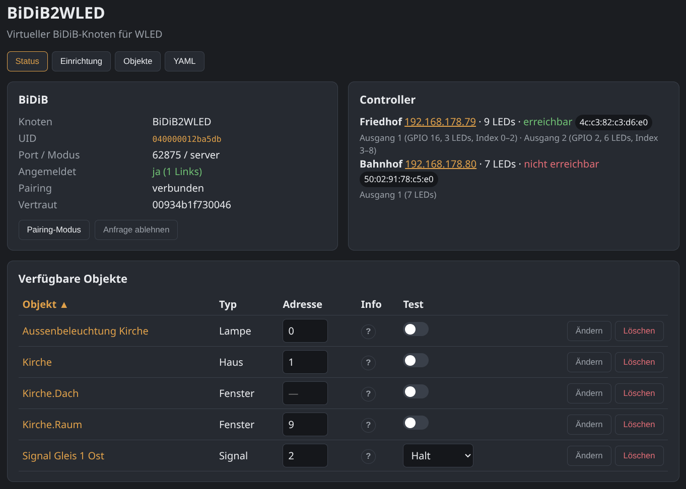
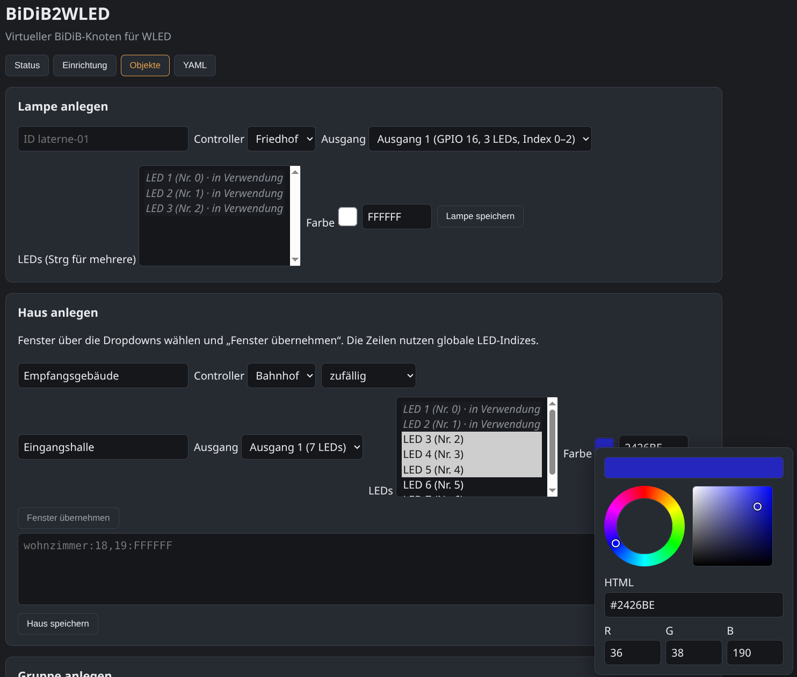

# BiDiB2WLED

Virtueller [BiDiB](https://bidib.org)-Knoten (**netBiDiB**), der [WLED](https://kno.wled.ge/)-Controller mit WS2812-ähnlichen LEDs auf der Modellbahn steuert.

Modellbahn-Software wie **Rocrail**, BiDiB-Wizard oder iTrain kennt WLED nicht. BiDiB2WLED hängt dazwischen: Die Steuerung schaltet ganz normale BiDiB-Accessories, die Bridge setzt das in LED-Befehle um.

Läuft unter **Linux**, **Windows** und **macOS** (Python 3.11 oder neuer).

## Was du damit machen kannst

| Objekt | Bedeutung | Schalten |
|---|---|---|
| **Lampe** | eine oder mehrere LEDs (Laterne, einzelnes Zimmer) | aus / an |
| **Haus** | mehrere Fenster mit Farbe und Einschaltverhalten (sofort, nacheinander, zufällig) | Haus als Ganzes; Fenster auch einzeln |
| **Gruppe** | mehrere Lampen/Häuser (z. B. eine Straße) | alle Mitglieder gemeinsam |
| **Sequenz** | gestaffeltes Ein- oder Ausschalten mit Pausen | an = Reihenfolge „an“, aus = umgekehrt |
| **Signal** | mehrere Begriffe (Halt, Fahrt, …), je Begriff eigene LEDs/Farben | Begriff (Aspekt) 0, 1, 2, … |
| **Spezial** | eingebauter WLED-Effekt (Feuer, Kerze, …) auf den gewählten LEDs | aus / an |
| **Fahrzeug** | Standmodell mit Lichtkanälen (Scheinwerfer, Blinker, Rundumlicht, …) | Modus (aus, Licht, Warnblinker, Einsatz, …) |

Zusätzlich: WLED-Geräte im Netz finden, LEDs am Modell identifizieren (blinken lassen), alles in der Weboberfläche anlegen und testen, dauerhaft als Dienst betreiben.





## Voraussetzungen

- Python 3.11 oder neuer (Debian/Ubuntu: `sudo apt install python3-venv python3-pip`)
- WLED-Controller im selben Netz (für echte LEDs). Ohne Hardware: `--simulate`
- Optional: Steuerungssoftware mit netBiDiB, z. B. [Rocrail](https://wiki.rocrail.net/), BiDiB-Wizard, iTrain

## Installation und Start

Im Projektverzeichnis:

```bash
python3 -m venv .venv
```

Umgebung aktivieren:

| System | Befehl |
|---|---|
| Linux / macOS | `source .venv/bin/activate` |
| Windows (cmd) | `.venv\Scripts\activate.bat` |
| Windows (PowerShell) | `.venv\Scripts\Activate.ps1` |

```bash
python -m pip install -U pip
python -m pip install -e ".[dev]"
```

Simulation (keine echten WLED-Geräte, Oberfläche zum Ausprobieren):

```bash
bidib2wled --simulate
```

oder `python -m bidib2wled --simulate`.

Danach im Browser: [http://127.0.0.1:8080](http://127.0.0.1:8080)

Mit echten Controllern (Suche nach `_wled._tcp`):

```bash
bidib2wled
```

| Option | Bedeutung |
|---|---|
| `--config PFAD` | YAML-Datei. Standard: `./config.yaml`, falls vorhanden, sonst das Benutzer-Konfigurationsverzeichnis |
| `--host ADRESSE` | Web-Bind, Standard `0.0.0.0` (alle Schnittstellen) |
| `--port N` | Web-Port, Standard `8080` |
| `--simulate` | kein HTTP zu WLED, Pixel nur intern |
| `-v` | ausführliche Logs |

Tests:

```bash
python -m pytest
```

Optional ein Installationspaket bauen:

```bash
python -m pip install build
python -m pip install -e .
python -m build
```

Artefakte liegen in `dist/`. Installation: `pip install dist/bidib2wled-*.whl`

## Linux: Installation als Dienst

Nach `pip install .` (systemweit oder in einer venv, dann `ExecStart` anpassen):

```bash
sudo useradd --system --home /var/lib/bidib2wled --create-home --shell /usr/sbin/nologin bidib2wled
sudo mkdir -p /etc/bidib2wled
sudo cp config.example.yaml /etc/bidib2wled/config.yaml
sudo chown -R bidib2wled:bidib2wled /etc/bidib2wled /var/lib/bidib2wled
sudo cp packaging/bidib2wled.service /etc/systemd/system/
# ExecStart auf den pip-Pfad anpassen, falls nicht /usr/bin/bidib2wled
sudo systemctl daemon-reload
sudo systemctl enable --now bidib2wled
```

Logs: `journalctl -u bidib2wled -f`

Ohne systemd: tmux/screen oder Desktop-Autostart mit `bidib2wled --config /pfad/config.yaml`.

## Windows

1. [Python 3.11+](https://www.python.org/downloads/) installieren, Haken bei „Add python.exe to PATH“.
2. Wie oben venv anlegen, `pip install -e .`, dann `bidib2wled`.
3. Autostart: Verknüpfung im Autostart-Ordner oder Aufgabenplanung auf  
   `…\.venv\Scripts\bidib2wled.exe --config %APPDATA%\bidib2wled\config.yaml`
4. Firewall: eingehend TCP **8080** (Web) und **62875** (netBiDiB), wenn Rocrail auf einem anderen Rechner läuft.
5. Fehlt die mDNS-Suche: IP des Controllers unter **Einrichtung** von Hand eintragen.

## macOS

Wie Linux: venv, `pip install -e .`, `bidib2wled`. Beim ersten Netz-Zugriff die Firewall für die Ports 8080 und 62875 erlauben.

Autostart z. B. als LaunchAgent (`~/Library/LaunchAgents/local.bidib2wled.plist`) mit `ProgramArguments` auf den venv-`bidib2wled` und die Config.

## WLED vorbereiten

Auf jedem Controller (WLED-Weboberfläche oder App), **einmalig**:

- WLAN, LED-Typ, GPIO, LED-Anzahl, Farbreihenfolge, Strombegrenzung
- mDNS-Name (z. B. `wled-dorf`)
- Boot-Preset **aus** / dunkel, damit nach Stromausfall nichts unkontrolliert leuchtet
- Sync zwischen Controllern **aus** – die Bridge orchestriert selbst. Ist Sync (oder E1.31/DMX) trotzdem aktiv, erscheint das unter **Status** am Controller.

**Nicht** in WLED anlegen: Segmente je Haus oder Fenster. Die Bedeutung der Pixel (welche LED welches Zimmer ist) liegt nur in BiDiB2WLED. Spezial-Effekte legt die Bridge selbst als Overlay-Segmente an.

## Ersteinrichtung

1. Dienst starten, Browser auf Port 8080.
2. Unter **Einrichtung** den Knotennamen und den netBiDiB-Port prüfen. **Server** ist der Normalfall: Rocrail verbindet sich zur Bridge (Standardport **62875**).
3. Gefundene WLED-Geräte benennen und **übernehmen** – oder IP von Hand eintragen.
4. Unter **Status** die IP eines Controllers anklicken, um dessen WLED-Seite zu öffnen. Unter **Einrichtung** Controller, Ausgang und LED wählen und **identifizieren** („welche Laterne blinkt?“).
5. Unter **Objekte** Lampen, Häuser, Gruppen, Sequenzen, Signale, Spezial-Effekte und Fahrzeuge anlegen. Speichern gibt eine Rückmeldung; Farben lassen sich über Farbrad, HTML-Wert oder RGB wählen. Bereits vergebene LEDs und Objekte sind in den Auswahllisten markiert.
6. Unter **Status → Verfügbare Objekte** testen (Schalter bzw. Signalbegriff), bei Bedarf **Ändern** oder **Löschen**.

Die Datei `config.yaml` ist das einzige Speicherformat. Die Oberfläche schreibt sie. Von Hand editieren geht ebenfalls; danach in der Oberfläche **Von Disk neu laden** oder einfach speichern – der Dienst prüft die Datei alle 2 Sekunden.

Vorlage: `config.example.yaml` nach `config.yaml` kopieren.

## Anbindung an Rocrail

BiDiB2WLED erscheint in Rocrail als **BiDiB-Knoten über netBiDiB** (TCP). Es gibt **keinen** direkten Rocrail-XML-Client (Port 8051) – der ist für eine spätere Ausbaustufe vorgesehen. Alles Schalten läuft über BiDiB-Accessories.

Voraussetzung: Objekte in der Weboberfläche anlegen und in der Simulation bzw. am Modell testen. Erst danach Rocrail anschließen.

### 1. Bridge als netBiDiB-Server

Unter **Einrichtung** (oder in der YAML):

```yaml
adapter:
  netbidib:
    aktiv: true
    modus: server
    port: 62875
    knotenname: BiDiB2WLED
```

Die Bridge lauscht dann auf Port **62875**. Rocrail und BiDiB2WLED müssen sich im Netz erreichen (gleiche Maschine: `127.0.0.1`; sonst die LAN-IP des Rechners, auf dem die Bridge läuft). Firewall für 62875/tcp öffnen.

Unter **Status → BiDiB** stehen Knotenname, UID, Port/Modus und ob jemand angemeldet ist.

### 2. Zentrale in Rocrail anlegen

In Rocview:

1. **Datei → Rocrail-Eigenschaften…** (nur verfügbar, wenn Rocview mit dem Rocrail-Server verbunden und der Automatikmodus aus ist).
2. Register **Zentrale**. Eine vorhandene virtuelle Zentrale kannst du entfernen, wenn du sie nicht brauchst.
3. Unten **bidib** wählen → **Hinzufügen**. Den neuen Eintrag **doppelklicken** (oder Eigenschaften öffnen).
4. **Schnittstellenkennung (IID):** z. B. `bidib` – diese IID brauchst du später an jedem Ausgang/Signal.
5. **Hostname:** IP oder Hostname der Bridge (`127.0.0.1`, wenn Rocrail und BiDiB2WLED auf demselben Rechner laufen).
6. **TCP-Port:** `62875` (oder der unter Einrichtung eingestellte Port).
7. **Sub-Bibliothek:** **netBiDiB** (nicht Serial/USB).
8. Beide Dialoge mit **OK** schließen, Plan **speichern**, danach **Rocrail und Rocview neu starten**. Erst der Neustart übernimmt die Zentrale.

Es gibt **keinen** eigenen Knopf „Kommunikation starten“. Nach dem Neustart verbindet Rocrail sich selbst. Prüfen kannst du das so:

- In der **BiDiB2WLED-Weboberfläche** unter Status: Pairing-Banner oder **Angemeldet: ja**.
- In Rocview optional **Steuerung → Kommunikation aktivieren** (Häkchen, kein Start-Button). BiDiB wird dort unterstützt.
- **Steuerung → Gleisspannung ein** ist bei BiDiB2WLED nicht nötig (die Bridge hat keine Gleisspannung).

**Register Knoten** liegt nicht in den allgemeinen Rocrail-Eigenschaften, sondern **in den Eigenschaften der bidib-Zentrale**: Datei → Rocrail-Eigenschaften → Zentrale → bidib-Eintrag doppelklicken → Register **Knoten**. Die Liste füllt sich erst, **nachdem** die Verbindung steht (also nach Neustart und Pairing). Alternativ: Menü **Programmieren → BiDiB**. Der Eintrag heißt oft nach der Unique-ID, nicht unbedingt „BiDiB2WLED“.

Rocrail erlaubt in der Regel nur **eine** aktive netBiDiB-Anmeldung am selben Knoten. BiDiB-Wizard und Rocrail nicht gleichzeitig auf denselben Knoten legen.

### 3. Pairing (nur beim ersten Mal)

netBiDiB verlangt eine Vertrauensstellung, damit nicht jeder im Netz den Knoten steuert. TCP kann schon verbunden sein, während Rocrail noch **„communication not ready (NOT paired)“** anzeigt – das ist genau dieser Schritt.

1. BiDiB2WLED muss **laufen**, bevor Rocrail verbindet.
2. Sobald Rocrail verbunden ist, erscheint in der Weboberfläche ein gelbes Banner mit der UID/dem Namen von Rocrail. Unter Status steht **Links** mindestens 1, **Angemeldet** noch nein.
3. **Pairing-Modus** klicken. Die Bridge akzeptiert Rocrail und merkt sich die UID unter **Vertraut**.
4. Danach **Angemeldet: ja**. Rocrail sollte die Meldung „NOT paired“ verlieren. Falls nicht: Rocrail einmal neu starten, Pairing ist gespeichert.

Reihenfolge ist egal: Du kannst auch zuerst **Pairing-Modus** drücken und danach Rocrail verbinden; die Bridge akzeptiert den nächsten unbekannten Host dann automatisch.

Ablehnen: **Anfrage ablehnen**. Erneutes Pairing: UID unter `adapter.netbidib.trusted` in der YAML löschen.

### 4. Accessory-Nummer nachschlagen

Jedes Objekt in BiDiB2WLED ist ein BiDiB-**Accessory**. Die Nummer steht in der Objektliste (Spalte **Adresse**), z. B. `0` bei Aussenbeleuchtung Kirche. Dort lässt sie sich auch ändern. Die Spalten **Objekt**, **Typ** und **Adresse** sind sortierbar.

BiDiB zählt ab **0**, Rocrail ab **1**. Die Spalte **Info** nennt die Werte für Rocrail (Adresse **+ 1**, Port 0, …); weitere Programme wie WinDigipet können dort ergänzt werden.

**Rocrail-Adresse = Adresse + 1**, **Port immer 0**.

| Objektliste (Adresse) | Rocrail-Adresse | Rocrail-Port |
|---|---|---|
| **0** Aussenbeleuchtung Kirche | 1 | 0 |
| **1** Kirche | 2 | 0 |

Neue Objekte (z. B. ein Signal) bekommen automatisch die nächste freie Adresse und behalten sie. Ohne festen Eintrag vergibt die Bridge die Nummern der Reihe nach (Fenster eines Hauses werden übersprungen – das Haus selbst ist schaltbar). Feste Nummern in der YAML sind BiDiB-Indizes (0, 1, 2, …):

```yaml
adapter:
  netbidib:
    accessories:
      0: Aussenbeleuchtung Kirche
      1: Kirche
```

### 5. Ausgang in Rocrail anlegen (Lampe, Haus, Gruppe, Sequenz, Spezial)

Voraussetzung: Unter Status **Angemeldet: ja**. Automatikmodus in Rocview aus.

BiDiB2WLED versteht nur **Accessory-Befehle**, keine einzelnen LC-Ports. Deshalb muss in Rocrail **Zubehör** an sein und das Protokoll **Default** bleiben (nicht NMRA-DCC).

1. In Rocview: **Tabellen → Ausgänge → Neu**.
2. Reiter **Allgemein**
   - **ID:** sprechend, z. B. `kirche-aussen` (nur in Rocrail sichtbar).
   - Typ: normaler Schalter (an/aus), kein Taster.
3. Reiter **Schnittstelle**

| Feld | Wert | Warum |
|---|---|---|
| **Schnittstellenkennung (IID)** | dieselbe wie an der bidib-Zentrale, z. B. `bidib` | sonst geht der Befehl an die falsche Zentrale |
| **Bus** | `0` | ein virtueller Knoten |
| **UID-Name** (falls vorhanden) | `BiDiB2WLED` oder leer | optional; Knotennamen von der Statusseite |
| **Protokoll** | **Default** | nicht NMRA-DCC (das wäre ein DCC-Decoder hinter einer BiDiB-Zentrale) |
| **Adresse** | Objektliste **+ 1** (steht unter Info) | BiDiB 0 = Rocrail 1 |
| **Port** | `0` | flache BiDiB-Adressierung |
| **Zubehör** | **Häkchen an** | sonst sendet Rocrail Port-Befehle, die die Bridge ignoriert |
| **Weiche** / **Einzel-Ausgang** | aus | das ist ein Ein/Aus-Ausgang, keine Weiche |

Beispiel **Aussenbeleuchtung Kirche** (Accessory 0): IID `bidib`, Adresse **1**, Port **0**, Zubehör an, Protokoll Default.

Beispiel **Kirche** (Accessory 1): dieselben Felder, Adresse **2**.

4. Mit **OK** speichern. Den Ausgang aus der Tabelle ins Stellwerk ziehen (oder Stellwerk-Symbol „Ausgang“ platzieren und die ID zuweisen).
5. Plan speichern. Klick auf das Symbol: **an** = Aspekt 1, **aus** = Aspekt 0.

Was der Klick bewirkt:

- **Lampe:** LEDs an oder aus
- **Haus:** Fenster nach dem in der Bridge eingestellten Verhalten
- **Spezial:** WLED-Effekt an oder aus (kein Pixel-für-Pixel)
- **Fahrzeug:** Modus 1 = Licht, höhere Modi je nach Anlage (Warnblinker, Einsatz); Blinker mehrerer Fahrzeuge sind nicht synchron
- **Gruppe:** alle Mitglieder
- **Sequenz:** an = gestaffelt ein, aus = gestaffelt aus; ein erneuter Befehl bricht eine laufende Sequenz ab

Dieselben Ausgänge funktionieren in **Aktionen**, **Fahrstraßen** und **Fahrplänen**.

Kommt kein Schaltbefehl an:

- Unter Status wirklich **Angemeldet: ja**?
- Steht unter **Info** dieselbe Rocrail-Adresse wie in Rocrail (Port 0)?
- **Zubehör** an, **Protokoll Default**, **Port 0**, IID identisch zur Zentrale?
- Test: Objekt in der Weboberfläche per Schalter umlegen – wenn das die LEDs schaltet, liegt der Fehler in der Rocrail-Adresse, nicht in WLED.

### 6. Signale schalten

Ein Signal hat mehrere Begriffe (Aspekte), nicht nur an/aus.

In Rocview: **Tabellen → Signale → Neu**.

- IID, Bus, Adresse (Objektliste **+ 1**, siehe Spalte **Info**), Port 0 und **Protokoll Default** wie beim Ausgang
- **Zubehör** aktivieren
- Unter **Muster / Begriffe** die Begriffsnummern eintragen, die in BiDiB2WLED gelten, z. B.:

| Rocrail-Begriff | Wert (Nummer) | typisch in der Bridge |
|---|---|---|
| Rot / Halt | 0 | Halt |
| Grün / Fahrt | 1 oder 2 | je nach angelegten Begriffen |
| Gelb | 1 | z. B. Halt erwarten |

Die Begriffsnummern sind dieselben wie in der Objektliste der Bridge (Auswahl **Halt** / **Fahrt** …) bzw. in der YAML unter `signale: … begriffe:`.

**Fahrzeuge** mit mehreren Modi (Licht, Warnblinker, Einsatz) werden in Rocrail ebenfalls als Signal angelegt. Die Modusnummern entsprechen der Auswahl in der Objektliste (0 = Aus).

### 7. Kurz-Check

1. Bridge läuft, unter Status **Angemeldet: ja**.
2. In **Verfügbare Objekte** lässt sich das Objekt per Schalter testen.
3. In Rocrail denselben Accessory über den Ausgang/das Signal schalten → LEDs und der Schalter in der Weboberfläche folgen.
4. Stellwerkssymbol bleibt während einer Sequenz „in Arbeit“ und geht danach in die Endlage (die Bridge meldet den Accessory-Zustand zurück).

## Andere BiDiB-Hosts

Dasselbe netBiDiB (Server, Port 62875, Pairing) funktioniert mit BiDiB-Wizard, iTrain und anderen Hosts, die Accessories schalten. Die Accessory-Nummern sind dieselben. Client-Modus (`modus: client` plus `host:`) nur, wenn die Bridge sich zu einem bestehenden netBiDiB-Server verbinden soll – der Normalfall ist Server.

## YAML (für Sicherung und Massenänderungen)

Beispielgerüst (siehe auch `config.example.yaml`):

```yaml
adapter:
  netbidib:
    aktiv: true
    modus: server
    port: 62875
    knotenname: BiDiB2WLED
    accessories:
      0: laterne-01
      1: haus-baecker

controller:
  - name: dorf
    ip: 192.168.1.51
    leds: 80

lampen:
  laterne-01:
    controller: dorf
    leds: [0]
    farbe: "FFB060"

haeuser:
  haus-baecker:
    controller: dorf
    einschalten: nacheinander
    fenster:
      wohnzimmer: { leds: [18, 19], farbe: "FFB060" }

gruppen:
  hauptstrasse:
    mitglieder: [laterne-01, haus-baecker]

sequenzen:
  seq-nacht:
    gruppen: [hauptstrasse]
    reihenfolge: zufaellig
    verzoegerung: [2s, 8s]

signale:
  signal-ausfahrt:
    controller: dorf
    begriffe:
      0: { name: Halt, leds: { 12: "FF0000" } }
      2: { name: Fahrt, leds: { 14: "00FF00" } }

spezial:
  kamin-feuer:
    controller: dorf
    leds: [10, 11, 12]
    effekt: 10
    palette: 0
    geschwindigkeit: 128
    intensitaet: 128
    farbe: "FF6A00"

fahrzeuge:
  pkw-rot:
    controller: dorf
    kanaele:
      licht: { leds: [30], anteil: rgb, farbe: "FFFFCC", art: dauer }
      blinker-l: { leds: [31], anteil: r, farbe: "FF8000", art: blinker }
      blinker-r: { leds: [31], anteil: g, farbe: "FF8000", art: blinker }
    modi:
      0: { name: Aus, kanaele: [] }
      1: { name: Licht, kanaele: [licht] }
      2: { name: Warnblinker, kanaele: [licht, blinker-l, blinker-r] }
  feuerwehr:
    controller: dorf
    kanaele:
      scheinwerfer: { leds: [32], anteil: r, farbe: "FFFFCC", art: dauer }
      ruecklicht: { leds: [32], anteil: g, farbe: "FF0000", art: dauer }
      rundum: { leds: [33], anteil: rgb, farbe: "0000FF", art: rundum }
    modi:
      0: { name: Aus, kanaele: [] }
      1: { name: Licht, kanaele: [scheinwerfer, ruecklicht] }
      3: { name: Einsatz, kanaele: [scheinwerfer, ruecklicht, rundum] }
```

Farben sind `RRGGBB` ohne `#`. LED-Indizes sind global auf dem Controller (Ausgang 1 beginnt bei 0). Spezial-Objekte nutzen die WLED-Effekte des Controllers (`effekt` / `palette` sind die Nummern aus der Weboberfläche). Fahrzeuge nutzen `anteil` (`r`/`g`/`b`/`rgb`) für einzelne LEDs an einem WS2811; `art: rundum` auf einem Pixel lässt die drei Anteile nacheinander aufleuchten. Blinker verschiedener Fahrzeuge haben unterschiedliche Perioden.

## Ports

| Port | Dienst |
|---|---|
| 8080/tcp | Weboberfläche |
| 62875/tcp | netBiDiB (Knoten-Server) |
| mDNS | `_wled._tcp` (Suche), `_bidib._tcp` und `_http._tcp` (Anzeige) |

## Architektur (Stufe 1)

- Kern schaltet logische Objekte und hält den Sollzustand.
- netBiDiB-Adapter: Pairing, Logon, Accessories (`MSG_ACCESSORY_SET` / `STATE` / `NOTIFY`).
- WLED: JSON-API, mDNS-Erkennung, Bindung an MAC.
- Web: Assistent, Übernehmen, Identifizieren, Testschalten, Bearbeiten, Löschen.

Noch nicht umgesetzt (siehe `KONZEPT.md`): direkter Rocrail-RCP-Client, Zeitautomatik über Modelluhr, WLED-Presets/UDP-Szenen.
